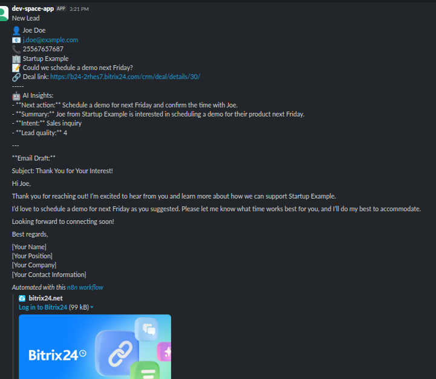

# AI-Powered Contact & Lead Management Automation with n8n, Bitrix24, and Slack
Automation is creating connections among tools, apps, and data. In that way, no manual or minimal manual effort is needed.\
For example, we could automate the editing and publication process: when someone uploads an article to Dropbox, a Python script checks the grammar and then publishes the article on a website.

In __this project__ we automate a notification process when someone submits a form with contact information: create a Bitrix24 contact, create a Bitrix24 deal, use AI to enhance the CRM phases, and finally send a Slack notification.\
The business problem to solve is part of the sales team's responsibilities. These teams manually copy and paste lead details from a company/buyer form into the CRM (Bitrix24), which causes:
- Delays in contacting and responding to leads.
- Human data-entry errors
- Missing opportunities due to slow or null follow-up.

# Skills you will strengthen with this project
1. n8n expertise
- Designing workflows with triggers, nodes, and error handling.
- Using HTTP Request nodes for API calls.
- Connecting CRMs, Google Drive, Notion, Slack, etc.
2. APIs & integrations
- Webhooks (trigger workflows on events).
- REST APIs (marketing tools, CRM, storage).
- Data mapping (convert JSON → structured data).
3. AI/LLM integration
- Using OpenAI inside workflows.
- Prompt engineering (system messages, role-based prompts).
- Summarization, writing draft emails, and decision-making.
4. Automation principles
- Scalability & reliability. Continue working even after receiving bad inputs and have the capacity to handle more loads.
- Documentation + reusability.
- Multi-step workflows.

# Overview
The project workflow is as follows:
1. A new form submission (Google Form) __triggers__ the workflow.
2. Create a new __Contact__ and the corresponding __Deal__ in Bitrix24.
3. Add __AI insights__ to the lead (summary, intent, lead quality, next action) for a rapid follow-up.
4. Send Slack notification to the sales team with lead details, AI insights, and a draft of the initial email.

The automated process turns raw data into __actionable sales intelligence__ leveraging context and lead information to accelerate sales-team action. 
# Project architecture
### Initial setup

__Setting n8n__ \
You can run n8n locally, in Docker, or in the cloud. If you already have an account, proceed to the next section, "Trigger". \
In this project, we run n8n using a Kubernetes cluster on an on-premise server; the setup includes a PostgreSQL database. For more information please check the `_infra/n8n_servicek8s/README.md` file.\
Once you finish the setup and run the service, navigate to `n8n.ajaw.duckdnss.org` and log in. \
If it's your first time using the service, proceed to configure it. Create an admin account by filling out the required information.

__Trigger__
We use a submission of a Google Form as a trigger. Then we need to create a Google Form, link it to a Google Sheet, and set up an Apps Script. We link the Google setup with the n8n Workflow by creating an n8n Webhook URL and including it in the Google Script. For details, check the `trigger` folder.

### CRM
__Bitrix24 endpoints__\
__Create a `Bitrix24 Contact`__ We use an `HTTP Request` node to call the `crm.contact.add` API, passing the data from each response of the Google Form. 

__Create a `Bitrix24 Deal`__ again, an `HTTP Request` node calls the `crm.deal.add` API. This step creates a new sales opportunity related to the contact.
You can find the details of API key creation and setup in the `crm.md` file.
### AI insights
Use a `Message a Model` node to provide valuable insights to the sales team, making the CRM process easier. Additionally, we request a draft of an initial email from the model.\
This setup saves you time in cases when submissions are spam or miss a message. In general, this addition leverages the sales team's capacities.\
Check the `prompting.md` file for details.
### Notification
We create an efficient Slack notification for the Sales team (Slack channel) by combining contact data, AI insights, and a direct link to Bitrix24 Deal, which speeds up the process. See an example in Figure 1.

  
   
  <em>Figure 1: A Slack Notification is the result of the workflow to upspeed the CRM. </em>

You can check the steps to send the notification in the `notification.md` file.

__Note__ Each time you include and configure a node, test it before adding a new one by clicking the "Execute step" button at the upper right corner of the node.

# n8n automation
You can find the the n8n workflow in the `lead_bitrix24.json` file.

# KIPs proposals
You can find sugestions of metrics to evaluate this workflow by assesing factors to improved the lead-to-contact latency, reducing manual-entry errors and measuring the qualified leads and sales activity. 

# Conclusions

We automate a crucial phase of the CRM, boosting the follow-up to increase successful deals and retain clients. This project also provides structured insights and AI-powered support to enable quick evaluation and response to leads. This workflow solves/improves the following stages of the CRM process:

- __Zero manual data entry__ by capturing data from a new submission of a form.
- __Faster response time__ by sending a Slack notification to the Sales team within seconds after a lead is created.
- __Smarter prioritization__ of leads thanks to the AI-generated `lead_quality` and `intent` features based on the submitted data.
- __Easier followup__ AI suggestions `next_action`
- __Tailored outreach__ AI-generated draft of an initial email based on the lead data.

# Future work
There are several ways to customize the workflow to fit specific needs based on your goals. Some suggestions are the following:
- Add a chat through Slack or WhatsApp to follow up on the lead. For example, once a sales member has received and reviewed the draft email, they modify it and send it back to n8n to be sent to the CRM service and to the lead.
- Add AI notes to the CRM.
- Deduplicate contacts in the Bitrix24 or the CRM service you want to use.
- Modify the form to include attachments and send them to the CRM.
- Setting up more services based on your needs, such as Slack+Teams+email.
- You can add Mock data to nodes to test them.
- AI enrichment. We can add Sentiment analysis to the contact's message, classify the message as a request or sales inquiry, and include business intelligence through an Internet search based on the contact information, among other features.