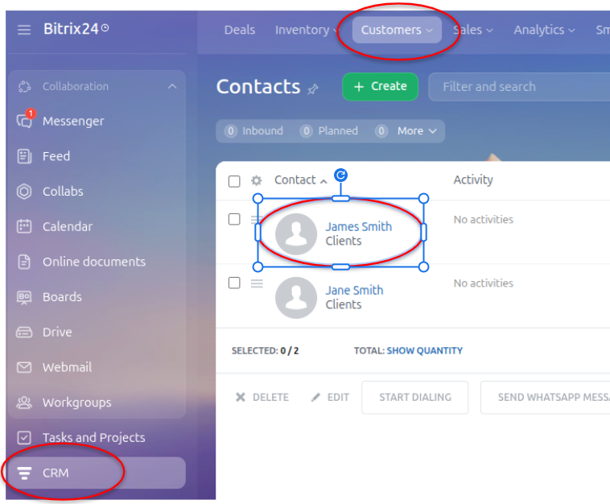
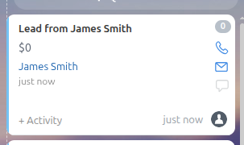

# CRM
In this project we use the platform __Bitrix24__ as CRM service, there are other options like HubSpot or Zoho. If you don't have a CRM account there are several platforms with a free trial to start.\
We use the `crm.contact.add` and `crm.deal.add` Bitrix24 APIs to update the lead data into our CRM service.\
First we pass the data from each response of the Google Form and create a Bitrix24 contact and then create a Bitrix24 deal to followup contacts.
## Overview
1. Setup a Bitrix24 Webhook URL.
2. Create a Bitrix24 Contact.
3. Create a Bitrix24 Deal.

## CRM architecture
### Setup a Bitrix24 Webhook URL.
Navigate to your Bitrix24 account and search in the left menu for "Developer resources" >> "Other" >> "Inbound webhook"\
It will generate a URL to call the REST API
    
    https://<yourcompany>.bitrix24.com/rest/123/abc123xyz/
This URL is the base of the Webhook URL then, each method youu want to use is appended at the end of the URL.\
You could test your URL by navigating to

    https://<yourcompany>.bitrix24.com/rest/123/abc123xyz/profile.json
It will return a JSON with the admin profile data.

### Create a Bitrix24 Contact
Add an `HTTP Request` node in your n8n workflow you can change the node name for a customized project, for example, called it as "create_contact".
Edit the node parameters as follow:

    Method: POST
    URL: https://<yourcompany>.bitrix24.com/rest/123/abc123xyz/crm.contact.add (append the method to the base Wbhook URL)
    Authentication: None
    Send body: Enable
    Body Content Type: JSON
    Specify Body: Using JSON
    JSON: 
        {
            "fields":{
                "NAME": "{{ $json.body.first_name }}",
                "LAST_NAME": "{{ $json.body.last_name }}",
                "EMAIL": [
                {
                "VALUE": "{{ $json.body.email_address }}", "VALUE_TYPE": "WORK"}],
                "PHONE": [
                {
                "VALUE": "{{$json.body.phone_number}}", "VALUE_TYPE": "WORK"}],
                "COMPANY_TITLE": "{{$json.body.company}}",
                "COMMENTS": "{{$json.body.message}}"
            }
        }

The JSON includes all the fields (data) from the Google form. The format follows the [Bitrix24 official-documentation](https://apidocs.bitrix24.com/api-reference/crm/contacts/crm-contact-add.html).\
The output includes the Bitrix24 contact id labeled as "result"
Go to your Bitrix24 account On the left menu search for "CRM", then click on the "Customers" tab an select "Contacts". The new contact will appear at the top of the displayed list (figure 1).

  
   
  <em>Figure 1: Bitrix24 Contact List</em>

### Create a Bitrix24 Deal
Add a second `HTTP Request` node and rename it to give more order to your workflow. We label the node as "create_deal" and configure your node as follow

    Method: POST
    URL: https://<yourcompany>.bitrix24.com/rest/123/abc123xyz/crm.deal.add.json
    Authentication: None
    Send Body: Enable
    Body Content Type: JSON
    Specify Body: Using JSON
    JSON:
        { 
            "fields": { 
                "TITLE": "Lead from {{ $('Webhook').item.json.body.first_name }} {{ $('Webhook').item.json.body.last_name }}", 
                "STAGE_ID": "NEW", 
                "CONTACT_ID": "{{ $('create_contact').item.json.result }}" 
            } 
        }

We make reference to a node by using the next notation `$('<specific_node>')`, in the above JSON the example is `$('Webhook')`. Remember to follow the [API documentation](https://apidocs.bitrix24.com/api-reference/crm/deals/crm-deal-add.html?tabs=defaultTabsGroup-p1klimt0_js).\
The output of the node provides the Bitrix24 id of the deal among other data.

<table>
  <tr>
    <td> 
    

    On your Bitrix24 account navigate to the "Deals" tab and look for the new deal (figure 2).
    

    </td> 
    <td>
    

         
        <em>Figure 2: Bitrix24 Deal </em>
      

      </td>
  </tr>
</table>

## Final notes
- Add Authentication for each node.
- Test each node before create the next one.
